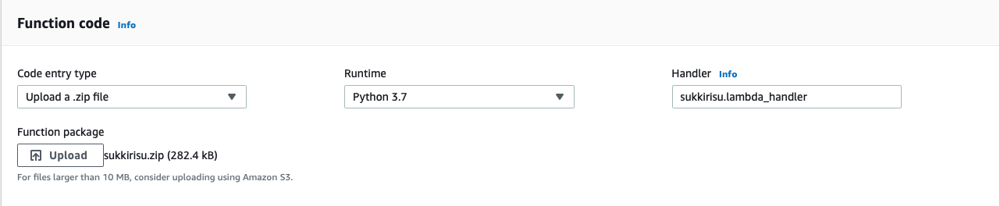

# sukkirisu
Today's sukkirisu (スッキリす, www.ntv.co.jp/sukkiri/sukkirisu/index.html) reporter

## Command line
### Installation
```sh
git clone https://github.com/ryotosaito/sukkirisu.git
cd sukkirisu
python3 -m venv .
. bin/activate
pip install -r requirements.txt
```

### Usage
```sh
python src/sukkirisu.py 1 #sukkirisu search for January
```

## Slack slash command using AWS Lambda
### Preparation
```sh
git clone https://github.com/ryotosaito/sukkirisu.git
cd sukkirisu/src
pip3 install -r requirements.txt -t .
zip -r sukkirisu.zip *
```

### In your AWS console: Lambda
#### Designer


- Click `+ Add triger` → select `API Gateway`
 - API: Create a new API
 - Security: Open
 - Additional Settings: None

#### Function Code



- Code entry type: Upload a .zip file (upload sukkirisu.zip created before)
- Runtime: Python 3.x
- Handler: `sukkirisu.lambda_handler`

